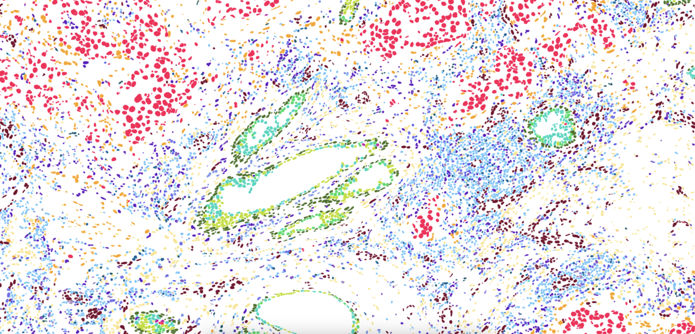
# Code companion to:
## High resolution mapping of the breast cancer tumor microenvironment using integrated single cell, spatial and in situ analysis of FFPE tissue
Amanda Janesick, Robert Shelansky, Andrew Gottscho, Florian Wagner, Morgane Rouault, Ghezal Beliakoff, Michelli Faria de Oliveira, Andrew Kohlway, Jawad Abousoud, Carolyn Morrison, Tingsheng Yu Drennon, Syrus Mohabbat, Stephen Williams, 10x Development Teams, Sarah Taylor

October 20, 2023

Link to the paper: https://www.biorxiv.org/content/10.1101/2022.10.06.510405v1

Link to the data: https://www.10xgenomics.com/products/xenium-in-situ/preview-dataset-human-breast

Available for download from GitHub: https://github.com/10XGenomics/janesick_nature_comms_2023_companion
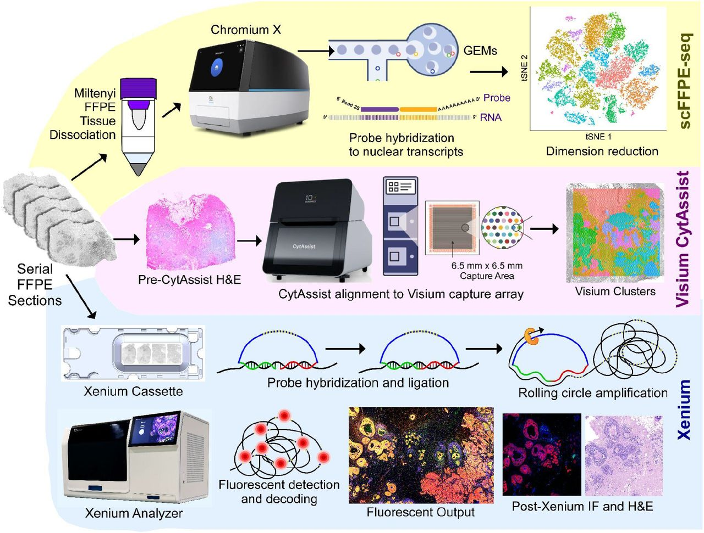


## Quick start guide
### Install conda and setup the conda environment
Conda installation instructions may be found [here](https://conda.io/projects/conda/en/latest/user-guide/install/index.html). If you choose to install miniconda, you will also need to install [jupyter](https://jupyter.org/) and its dependencies. 

The conda environment file, ```environment.yaml```, may be found in the [10xGenomics github repository](https://github.com/10XGenomics/janesick_nature_comms_2023_companion). To create the publication environment, run the following commands in the terminal. After creating the environment from within the open notebook, select the environment, ```xenium-publication-env```, from the ```kernels``` dropdown menu. A resource for managing conda environments may be found [here](https://conda.io/projects/conda/en/latest/user-guide/tasks/manage-environments.html). 
```bash
## make sure conda is installed (miniconda)
conda --version 

## download yaml, ipynb, py files from github repo
## https://github.com/10XGenomics/janesick_nature_comms_2023_companion

## create conda conda_environment
conda env create -f environment.yaml

## activate conda environment
conda activate xenium-publication-env

## check you have the right conda environment
conda info --envs
```
### Publication data paths
Data used in this document can be downloaded at https://www.10xgenomics.com/products/xenium-in-situ/preview-dataset-human-breast.  For this analysis we will use data from ```In Situ Sample 1, Replicate 1``` and ```Visium Spatial```. In addition, you will also need to download the  ```Cell_Barcode_Type_Matrices.xlsx``` found in ```In Situ Sample 1, Replicate 1``` under the heading ```Cell Type Annotations```. Data for the publication can also be obtained from [GEO:GSE243275](https://www.ncbi.nlm.nih.gov/geo/query/acc.cgi?acc=GSE243275).

### In your $HOME directory
#### Download and unzip the Xenium output bundle
```bash
mkdir xenium-publication
cd xenium-publication

mkdir xenium
cd xenium
curl -O https://cf.10xgenomics.com/samples/xenium/1.0.1/Xenium_FFPE_Human_Breast_Cancer_Rep1/Xenium_FFPE_Human_Breast_Cancer_Rep1_outs.zip
unzip Xenium_FFPE_Human_Breast_Cancer_Rep1_outs.zip
cd ..
```
#### Download and unzip Visium data
```bash
mkdir visium
cd visium
curl -O https://cf.10xgenomics.com/samples/spatial-exp/2.0.0/CytAssist_FFPE_Human_Breast_Cancer/CytAssist_FFPE_Human_Breast_Cancer_filtered_feature_bc_matrix.h5
curl -O https://cf.10xgenomics.com/samples/spatial-exp/2.0.0/CytAssist_FFPE_Human_Breast_Cancer/CytAssist_FFPE_Human_Breast_Cancer_spatial.tar.gz
unzip CytAssist_FFPE_Human_Breast_Cancer_spatial.tar.gz
cd ..

cd ..
```
#### Saving the cell_groups.csv file
The ```Cell_Barcode_Type_Matrices.xlsx``` contains all the annotation for the paper. For this analysis we will only make use of the supervised labeling from Xenium Sample 1, Replicate 1. Use ```SaveAs``` to save the ```Xenium R1 Fig1-5 (supervised)``` tab as a CSV file. We will refer to it in the code as the ```cell_groups.csv```. Move the ```cell_groups.csv``` into the ```xenium-publication``` directory we just created. 

#### Define data paths
The following file paths assume that the xenium-publication was created as described above in the user's $HOME directory.


```python
from pathlib import Path
path_to_visium_bundle = Path("~/xenium-publication/visium/").expanduser()
path_to_xenium_bundle = Path("~/xenium-publication/xenium/outs").expanduser()
path_to_xenium_celltype_labels = Path("~/xenium-publication/cell_groups.csv").expanduser()
```

### Module Imports


```python
import json
from collections import namedtuple, Counter

import numpy as np
import scanpy as sc
import pandas as pd

## Image manipulation and geometry
from tifffile import imread
from skimage.io import imread as skimread

## Plotting imports
from matplotlib import pyplot as plt
from matplotlib.colors import LinearSegmentedColormap, Normalize, to_hex, Colormap
from matplotlib.cm import ScalarMappable

### Functions for registration of Xenium to Visium data and associated analyis and visualization
## Visualization functions
from companion_functions import (
    hexlist_to_cmap,
    polygons_coords_to_patch_collection,
    plot_polygons,
    hex_corner_offset,
    polygon_corners,
    celltypes,
    celltypes,
    hex_codes,
    ctype_to_code_map,
    ctype_hex_map,
    ctype_cmap,
)

## Analysis functions
from companion_functions import (
    unique_encode,
    get_xenium_to_morphology_transform_from_xenium_morphology_image,
    get_xenium_capture_polygon_um,
    transform_coordinates,
    get_median_spot_to_spot_distance_from_centroids,
    generate_space_filling_visium_polygons,
    get_visium_capture_polygon,
    __OUTSIDE_VISIUM_CAPTURE_AREA_BARCODE__,
    bin_xenium_data_to_visium_spots,
    generate_anndata_matrix_from_transcript_assignments,
)
```

#### Outputs for Visium data
For an overview of Visium output files, see [this page](https://www.10xgenomics.com/support/software/space-ranger/analysis/outputs/output-overview).


```python
## Load Visium spot X gene matrix
visium_adata = sc.read_10x_h5(path_to_visium_bundle / "CytAssist_FFPE_Human_Breast_Cancer_filtered_feature_bc_matrix.h5")

## Load Visium spot position information
visium_tissue_positions = (
    pd.read_csv(path_to_visium_bundle / "spatial" / "tissue_positions.csv")
    .set_index("barcode")
    .reindex(visium_adata.obs.index)
)

## Load Visium scale metadata
## Contains scalefactors to transform between Visium full resolution and the high resolution images.
with open(path_to_visium_bundle / "spatial" / "scalefactors_json.json") as file:
    visium_scale_factors = json.load(file)

## Load the Visium high resolution H&E for plotting
visium_high_res_image = skimread(
    path_to_visium_bundle / "spatial" / "tissue_hires_image.png"
)
```


#### IO for Xenium data
Information about the Xenium output bundle may be found [here](https://www.10xgenomics.com/support/in-situ-gene-expression/documentation/steps/onboard-analysis/understanding-xenium-outputs).


```python
## Read in Xenium transcript data and decode the bytes column to string
xenium_transcripts = pd.read_parquet(path_to_xenium_bundle / "transcripts.parquet")
xenium_transcripts.feature_name = xenium_transcripts.feature_name.str.decode("utf-8")

## Read in the Xenium cell positions and cell metadata.
xenium_cell_info = pd.read_csv(path_to_xenium_bundle / "cells.csv.gz").set_index(
    "cell_id"
)

## Read in the Xenium morphology (DAPI) MIP image. Note: We are reading the image at the resolution of
## the third pyramid level: full_resolution / 2 ** 3. We are using this image for plotting.
## The Xenium imaging area is large, and the full resolution image is large enough to be slow to plot.
## Working with a lower resolution image when possible is a convenience.
pyramid_level = 3
xenium_morphology_mip_at_pyramid_level = imread(
    path_to_xenium_bundle / "morphology_mip.ome.tif", series=0, level=pyramid_level
)

## Read in the nucleus boundary polygon information. Xenium polygons are a plotting convenience and should not
## be used for analysis. A nucleus mask is provided for analysis of Xenium segmentation.
xenium_nucleous_boundaries_df = pd.read_parquet(
    path_to_xenium_bundle / "nucleus_boundaries.parquet"
)

## Transformation matrix to transform from the Xenium coordinate system to the morphology image coordinate system
## at pyramid level. Determined using the pixel size of the morphology image. 
xenium_to_morphology_at_pyramid_transformation = (
    get_xenium_to_morphology_transform_from_xenium_morphology_image(
        path_to_xenium_bundle / "morphology_mip.ome.tif", pyramid_level
    )
)

## Cell type assignments as determined by label transfer from a matched FLEX dataset.
## This is a supplemental file provided within the publication.
## barcode X celltype
xenium_celltype_df = pd.read_csv(path_to_xenium_celltype_labels).set_index("Barcode")
```

### The transformation matrix as determined by registration using Xenium Explorer
The following registration matrix was generated using the Xenium Explorer registration tool.
The full resolution Visium H&E image was loaded into Xenium Explorer's H&E registration workflow, then the transformation matrix was exported using the transformation export feature. It was directly copied into the cell below for convenience. Some further addendums to the transformation matrix are required to map Xenium coordinates into Visium coordinates. They are described inline. 

For information about the Xenium Explorer H&E registration workflow, see the [Xenium Explorer image alignment tutorial](
https://www.10xgenomics.com/support/software/xenium-explorer/tutorials/xe-image-alignment).


```python
## Transformation matrix exported from Xenium Explorer
xenium_morphology_to_visium_full_res_transformation = np.array(
    [
        [1.87594468e-02, -4.07641677e-01, 1.63476055e04],
        [3.91300071e-01, 1.26819551e-02, 4.12499099e03],
        [-8.39854141e-08, -9.91112632e-07, 1.03706895e00],
    ]
)

## Transformation matrix between Xenium full resolution (DAPI) morphology image and the Xenium coordinate system.
xenium_to_morphology_transformation = (
    get_xenium_to_morphology_transform_from_xenium_morphology_image(
        path_to_xenium_bundle / "morphology_mip.ome.tif", 0
    )
)

## Xenium coordinates must be transformed into image coordinates before being transformed into Visium image coordinates.
## The following describes that combined transformation (a matrix multiplication of the two transformation matrices).
xenium_to_visium_full_res_transformation = (
    xenium_morphology_to_visium_full_res_transformation
    @ xenium_to_morphology_transformation
)
```

## Figures demonstrating Xenium / Visium registration and analysis

#### Xenium coordinate transformations
The following figure describes a transformation between the Xenium coordinate space and the Xenium morphology image. 
However, for plotting convenience, the target morphology image is not full resolution. 


The DAPI image is in the background, while gold cells centroids are overlaid as points. 


```python
## data setup
## get Xenium coordinates -> transformed into Xenium morphology pixel coordinates
coords = transform_coordinates(
    xenium_cell_info[["x_centroid", "y_centroid"]].values,
    xenium_to_morphology_at_pyramid_transformation,
)

## plot style setup
fig = plt.figure(figsize=(8, 8))
ax = plt.gca()

## plotting code
ax.imshow(xenium_morphology_mip_at_pyramid_level)
ax.scatter(*coords.T, s=0.1, linewidth=0, edgecolor=None, marker="o", color="yellow")

## plot style adjustments
ax.spines.right.set_visible(False)
ax.spines.top.set_visible(False)
ax.yaxis.set_ticks_position("left")
ax.xaxis.set_ticks_position("bottom")
ax.set_aspect("equal", adjustable="box")
```


    
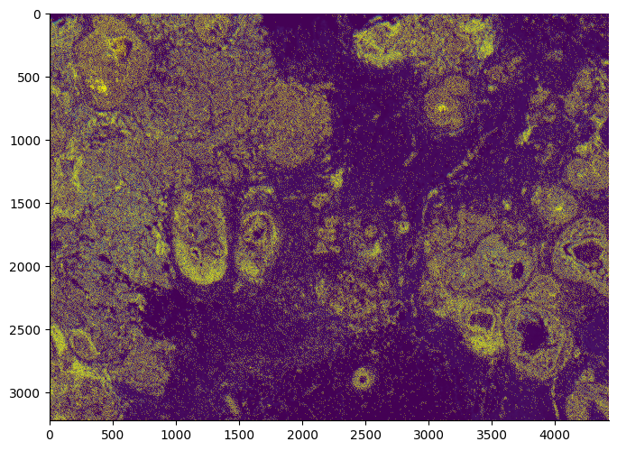
    


#### Figure demonstrating the Xenium/Visium registration

The Visium H&E high resolution image is displayed with Xenium cell coordinates transformed and overlaid in gold. For demonstration, the Xenium morphology image bounding polygon is displayed in blue.


```python
## data setup
## Xenium cell coordinates are transformed first into Visium full resolution image coordinates,
## and then scaled to high resolution image coordinates.
xenium_cell_centroids_visium_high_res = (
    transform_coordinates(
        xenium_cell_info[["x_centroid", "y_centroid"]].values,
        xenium_to_visium_full_res_transformation,
    )
    * visium_scale_factors["tissue_hires_scalef"]
)

## The Xenium capture polygon is obtained and similarly transformed.
xenium_capture_polygon_um = get_xenium_capture_polygon_um(path_to_xenium_bundle)
xenium_capture_polygon_visium_high_res = (
    transform_coordinates(
        xenium_capture_polygon_um, xenium_to_visium_full_res_transformation
    )
    * visium_scale_factors["tissue_hires_scalef"]
)

## plot style setup
fig = plt.figure(figsize=(8, 8))
ax = plt.gca()

## plotting code
ax.imshow(visium_high_res_image)
ax.scatter(
    *xenium_cell_centroids_visium_high_res.T,
    s=0.1,
    linewidth=0,
    edgecolor=None,
    marker="o",
    color="gold"
)
plot_polygons(
    [xenium_capture_polygon_visium_high_res],
    ax=ax,
    facecolor=(0, 0, 0, 0),
    edgecolor="blue",
    linewidth=1,
)

## plot style adjustments
ax.spines.right.set_visible(False)
ax.spines.top.set_visible(False)
ax.yaxis.set_ticks_position("left")
ax.xaxis.set_ticks_position("bottom")
ax.set_aspect("equal", adjustable="box")
```


    
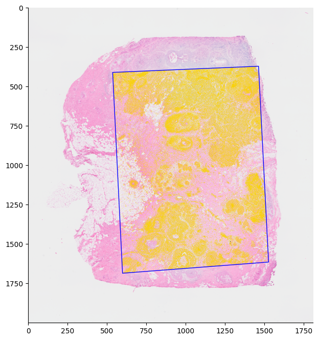
    


#### Figure demonstrating the Visium capture area and spot locations
The Visium H&E high resolution image is displayed with the Visium capture area, displayed in cyan, and the Visium spots, represented as space-filling hexagons in black.


```python
## data setup
## Space filling polygons are generated and then transformed in the high resolution coordinate system.
visium_hexegon_polygons = generate_space_filling_visium_polygons(
    spot_coords=visium_tissue_positions[
        ["pxl_col_in_fullres", "pxl_row_in_fullres"]
    ].values,
)

visium_capture_polygon_full_res = get_visium_capture_polygon(
    spot_centroids=visium_tissue_positions[
        ["pxl_col_in_fullres", "pxl_row_in_fullres"]
    ].values,
    spot_diameter=visium_scale_factors["spot_diameter_fullres"],
)


visium_hexagon_polygons_high_res = (
    visium_hexegon_polygons * visium_scale_factors["tissue_hires_scalef"]
)
visium_capture_polygon_high_res = (
    visium_capture_polygon_full_res * visium_scale_factors["tissue_hires_scalef"]
)


## plot style setup
fig = plt.figure(figsize=(8, 8))
ax = plt.gca()

## plotting code
ax.imshow(visium_high_res_image)
plot_polygons(
    visium_hexagon_polygons_high_res,
    ax=ax,
    facecolor=(0, 0, 0, 0),
    edgecolor="black",
    linewidth=1,
)
plot_polygons(
    [visium_capture_polygon_high_res],
    ax=ax,
    facecolor=(0, 0, 0, 0),
    edgecolor="cyan",
    linewidth=1,
)

## plot style adjustments
ax.spines.right.set_visible(False)
ax.spines.top.set_visible(False)
ax.yaxis.set_ticks_position("left")
ax.xaxis.set_ticks_position("bottom")
ax.set_aspect("equal", adjustable="box")
```


    
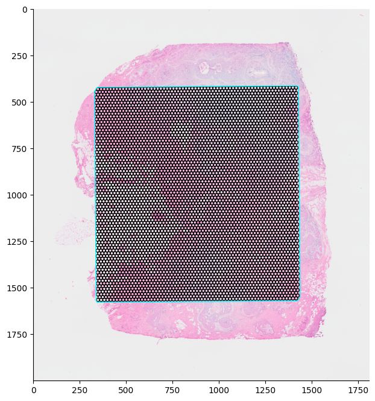
    


#### Figure demonstrating the Visium data for the gene TACSTD2
The Visium H&E high resolution image is displayed with the Visium capture area, displayed in red, and the Visium spots, represented as space-filling hexagons colored by the UMI count of TACSTD2 in each spot. The colormap is set such that the deepest red is set to the 95 percentile.   


```python
## Data setup
gene = "TACSTD2"
feature_barcode_df = visium_adata.to_df()

## Space filling polygons are generated and then transformed in the high resolution coordinate system.
hexegon_polygons_fullres = generate_space_filling_visium_polygons(
    spot_coords=visium_tissue_positions.loc[feature_barcode_df.index][
        ["pxl_col_in_fullres", "pxl_row_in_fullres"]
    ].values,
)
hexegon_polygons_highres = (
    hexegon_polygons_fullres * visium_scale_factors["tissue_hires_scalef"]
)

## UMI counts per barcode
counts = feature_barcode_df.loc[:, gene].values

## plot style setup
fig = plt.figure(figsize=(8, 8))
ax = plt.gca()
norm = Normalize(vmin=0, vmax=np.quantile(counts, [0.95])[0])
cmap = LinearSegmentedColormap.from_list(
    "Yellow/Orange/Red", colors=["#ebebeb", "#FFD700", "#DC143C", "#4B0082"]
)

## plotting code
ax.imshow(visium_high_res_image)
plot_polygons(hexegon_polygons_highres, ax=ax, array=counts, cmap=cmap, norm=norm)
sm = ScalarMappable(cmap=cmap, norm=norm)
fig.colorbar(sm, ax=ax)

## plot style adjustments
ax.spines.right.set_visible(False)
ax.spines.top.set_visible(False)
ax.yaxis.set_ticks_position("left")
ax.xaxis.set_ticks_position("bottom")
ax.set_aspect("equal", adjustable="box")
```


    
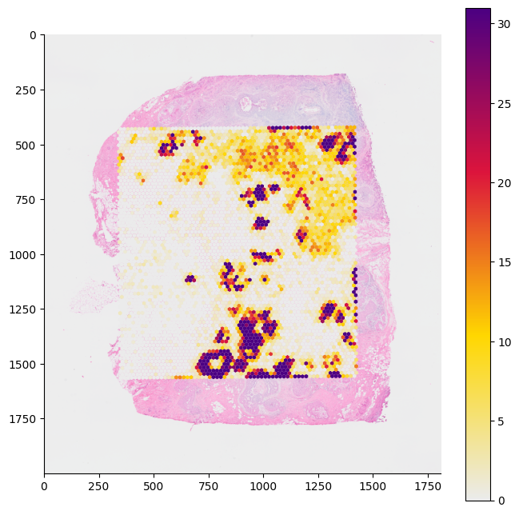
    


#### Figure demonstrating the different capture areas for the Xenium assay and the Visium assay run on two different slides. 
The Visium H&E high resolution image is displayed with the Visium capture area displayed in cyan and the Visium spots represented as space-filling hexagons colored by in black. Xenium cell coordinates are transformed and overlaid in gold. The Xenium morphology image bounding polygon is displayed in blue.


```python
## Data setup
## Xenium cell cordinates are transformed into Visium high resolution image coordinates.
xenium_cell_centroids_visium_high_res = (
    transform_coordinates(
        xenium_cell_info[["x_centroid", "y_centroid"]].values,
        xenium_to_visium_full_res_transformation,
    )
    * visium_scale_factors["tissue_hires_scalef"]
)

## Xenium capture area polygon is transformed into Visium high resolution image coordinates.
xenium_capture_polygon_um = get_xenium_capture_polygon_um(path_to_xenium_bundle)
xenium_capture_polygon_visium_high_res = (
    transform_coordinates(
        xenium_capture_polygon_um, xenium_to_visium_full_res_transformation
    )
    * visium_scale_factors["tissue_hires_scalef"]
)

## Space filling polygons are generated and then transformed  into high resolution image coordinates.
visium_hexegon_polygons = generate_space_filling_visium_polygons(
    spot_coords=visium_tissue_positions[
        ["pxl_col_in_fullres", "pxl_row_in_fullres"]
    ].values,
)
## Visium capture area polygons are generated and then transformed into high resolution image coordinates.
visium_catpure_polygon_full_res = get_visium_capture_polygon(
    spot_centroids=visium_tissue_positions[
        ["pxl_col_in_fullres", "pxl_row_in_fullres"]
    ].values,
    spot_diameter=visium_scale_factors["spot_diameter_fullres"],
)

visium_hexagon_polygons_high_res = (
    visium_hexegon_polygons * visium_scale_factors["tissue_hires_scalef"]
)
visium_catpure_polygon_high_res = (
    visium_catpure_polygon_full_res * visium_scale_factors["tissue_hires_scalef"]
)

## plot style setup
fig = plt.figure(figsize=(8, 8))
ax = plt.gca()

## plotting code
ax.imshow(visium_high_res_image)
plot_polygons(
    visium_hexagon_polygons_high_res,
    ax=ax,
    facecolor=(0, 0, 0, 0),
    edgecolor="black",
    linewidth=1,
)
plot_polygons(
    [visium_catpure_polygon_high_res],
    ax=ax,
    facecolor=(0, 0, 0, 0),
    edgecolor="cyan",
    linewidth=1,
)
ax.scatter(
    *xenium_cell_centroids_visium_high_res.T,
    s=0.1,
    linewidth=0,
    edgecolor=None,
    marker="o",
    color="gold"
)
plot_polygons(
    [xenium_capture_polygon_visium_high_res],
    ax=ax,
    facecolor=(0, 0, 0, 0),
    edgecolor="blue",
    linewidth=1,
)

## plot style adjustments
ax.spines.right.set_visible(False)
ax.spines.top.set_visible(False)
ax.yaxis.set_ticks_position("left")
ax.xaxis.set_ticks_position("bottom")
ax.set_aspect("equal", adjustable="box")
```


    
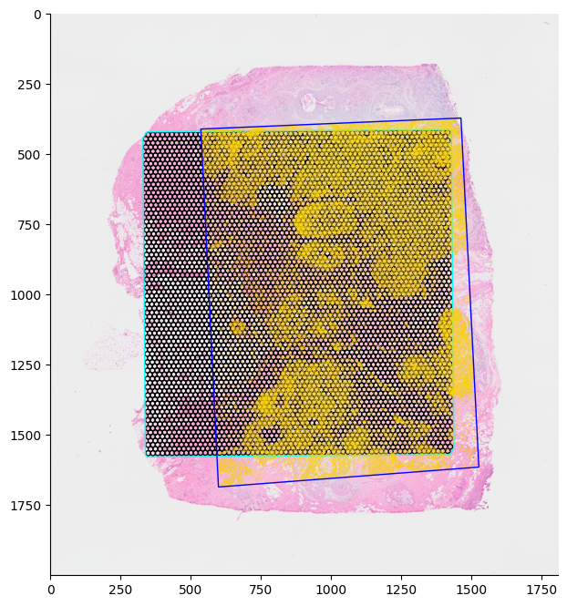
    


### Visium spot interpolation of Xenium data using Xenium/Visium registration


```python
## Filter Xenium transcripts for only *high* quality transcripts. The Xenium cell-feature matrix is generated only
## from high quality transcripts. However, the Xenium output bundle includes low quality transcripts. The following
## interpolation is to be accomplished using the same transcripts found in the cell-feature matrix.
## For more information see:
## https://www.10xgenomics.com/resources/analysis-guides/continuing-your-journey-after-xenium-analyzer
xenium_transcript_selection = xenium_transcripts.qv >= 20

## Transcript to spot interpolation
xenium_spotbinned_transcript_barcodes = bin_xenium_data_to_visium_spots(
    visium_spot_centroids=visium_tissue_positions[
        ["pxl_col_in_fullres", "pxl_row_in_fullres"]
    ].values,
    visium_spot_diameter=visium_scale_factors["spot_diameter_fullres"],
    visium_barcodes=visium_tissue_positions.index.values,
    xenium_coords=xenium_transcripts[xenium_transcript_selection][
        ["x_location", "y_location"]
    ].values,
    xenium_to_visium_transform=xenium_to_visium_full_res_transformation,
)

## The Xenium capture area does not perfectly overlap the Visium capture area. We want to
## ignore Xenium transcripts which fall outside of the overlap.
unassigned_transcript_mask = (
    xenium_spotbinned_transcript_barcodes != __OUTSIDE_VISIUM_CAPTURE_AREA_BARCODE__
)

## Generating a cell-feature matrix from the interpolation
xenium_spotbinned_transcript_adata = (
    generate_anndata_matrix_from_transcript_assignments(
        barcodes=xenium_spotbinned_transcript_barcodes[unassigned_transcript_mask],
        feature_names=xenium_transcripts[xenium_transcript_selection][
            unassigned_transcript_mask
        ]["feature_name"].values,
    )
)
```

#### Figure demonstrating Xenium spot interpolation of Visium spots for the gene TACSTD2
The Visium H&E high resolution image is displayed with the interpolated Visium spots represented as space filling hexagons colored by the Xenium transcript counts for TACSTD2 assigned to each spot. The colormap is set such that the deepest red is set to the 95 percentile.


```python
gene = "TACSTD2"
feature_barcode_df = xenium_spotbinned_transcript_adata.to_df()

## get Visium spot space-filling polygons and transform them into the high resolution image coordinates.
hexegon_polygons_fullres = generate_space_filling_visium_polygons(
    spot_coords=visium_tissue_positions.loc[feature_barcode_df.index][
        ["pxl_col_in_fullres", "pxl_row_in_fullres"]
    ].values,
)
hexegon_polygons_highres = (
    hexegon_polygons_fullres * visium_scale_factors["tissue_hires_scalef"]
)

## collect gene counts for each spot
counts = feature_barcode_df.loc[:, gene].values

## plot style setup
norm = Normalize(vmin=0, vmax=np.quantile(counts, [0.95])[0])
cmap = LinearSegmentedColormap.from_list(
    "Yellow/Orange/Red", colors=["#ebebeb", "#FFD700", "#DC143C", "#4B0082"]
)
fig = plt.figure(figsize=(8, 8))
ax = plt.gca()

## plotting code
ax.imshow(visium_high_res_image)
plot_polygons(hexegon_polygons_highres, ax=ax, array=counts, cmap=cmap, norm=norm)
sm = ScalarMappable(cmap=cmap, norm=norm)
fig.colorbar(sm, ax=ax)

## plot style adjustments
ax.spines.right.set_visible(False)
ax.spines.top.set_visible(False)
ax.yaxis.set_ticks_position("left")
ax.xaxis.set_ticks_position("bottom")
ax.set_aspect("equal", adjustable="box")
```


    
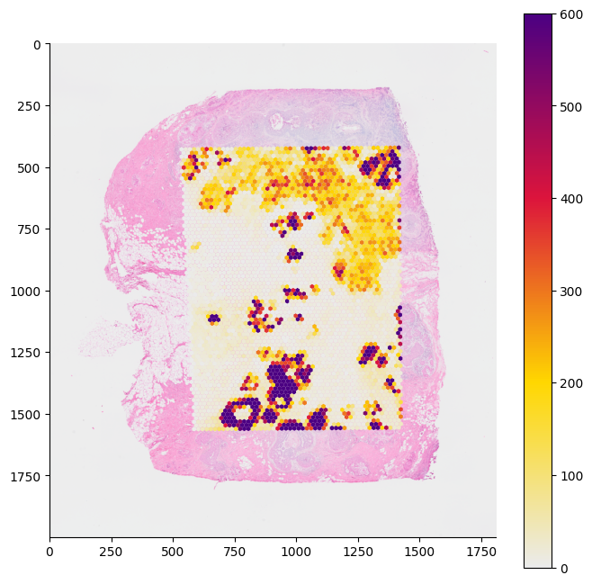
    


## Figure showing correlation between interpolated/actual Visium spots for the gene TACSTD2


```python
## Data setup
## Collating both interpolated Visium spots and actual Visium spots
## The Xenium and Visium gene sets differ; here we are filtering the two data frames to
## ensure they share the exact same genes. In addition, we can only interpolate Visium spot counts for
## which we have Xenium data. We remove all spots which do not overlap between the two modalities.
xenium_df = xenium_spotbinned_transcript_adata.to_df()
visium_df = visium_adata.to_df()

shared_barcodes = xenium_df.index.intersection(visium_df.index)
shared_genes = xenium_df.columns.intersection(visium_df.columns)

shared_xenium_df = xenium_df.loc[shared_barcodes, shared_genes]
shared_visium_df = visium_df.loc[shared_barcodes, shared_genes]

Gene = "TACSTD2"

## Plot style setup
fig = plt.figure(figsize=(8, 8))
ax = plt.gca()

## Plotting code
ax.scatter(shared_visium_df[Gene], shared_xenium_df[Gene], s=5)
ax.set_xscale("log")
ax.set_yscale("log")

## Plot style adjustments
ax.set_xlabel("Xenium transcript count")
ax.set_ylabel("Visium transcript count")
ax.spines.right.set_visible(False)
ax.spines.top.set_visible(False)
ax.yaxis.set_ticks_position("left")
ax.xaxis.set_ticks_position("bottom")
```


    
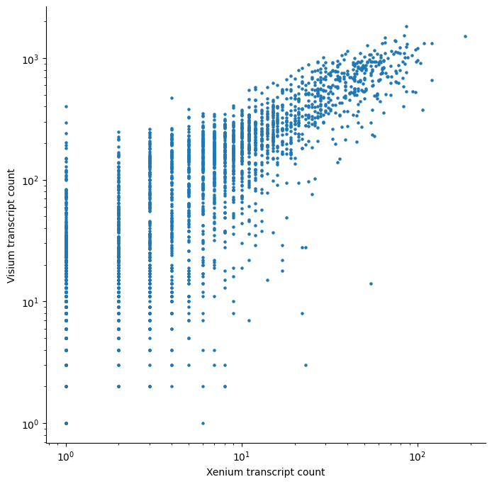
    


#### Figure showing Xenium data overlaid with label-transferred cell types
Data wrangling the polygons is a bit slow, however it can be worth the wait, the resolution of the segmentation allows for beautiful whole tissue figures. 


```python
## Data setup
## Collection Xenium nucleous boundaries from the parquet file. Polygons are organized in order and each row
## corresponds to an individual vertex.
## This line is the slow bit. Cache for faster plotting.
xenium_nucleous_polygons = [
    poly[["vertex_x", "vertex_y"]].values
    for i, poly in xenium_nucleous_boundaries_df.groupby("cell_id")
]

## Plot style setup
fig = plt.figure(figsize=(8, 8))
ax = plt.gca()

## Plotting code
plot_polygons(
    xenium_nucleous_polygons,
    ax=ax,
    array=list(map(ctype_to_code_map.get, xenium_celltype_df.Cluster.values)),
    edgecolor="black",
    linewidth=0.01,
    norm=Normalize(vmin=0, vmax=len(celltypes)),
    cmap=ctype_cmap,
)

## Plot style adjustments
ax.spines.right.set_visible(False)
ax.spines.top.set_visible(False)
ax.yaxis.set_ticks_position("left")
ax.xaxis.set_ticks_position("bottom")
ax.set_aspect("equal", adjustable="box")
```


    
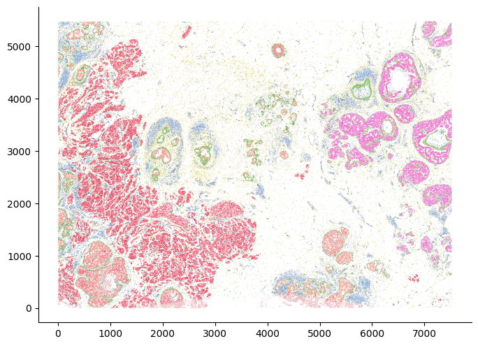
    


## Figure showing Xenium cell type proportions


```python
## Data setup
celltype_data = xenium_celltype_df.groupby("Cluster").size()
normed_celltype_data = (celltype_data / celltype_data.sum()).sort_values(
    ascending=False
)

## Plot style setup
fig = plt.figure(figsize=(3, 5))
ax = plt.gca()

## Plotting code
x = [0]
data = celltype_data.values[:, np.newaxis]
bottom = np.zeros(data.shape[1])
for ctype, y in zip(celltype_data.index.values, data):
    ax.bar(x, y, bottom=bottom, color=ctype_hex_map[ctype])
    bottom += y


## Plot style adjustments
ax.xaxis.set_ticks(x)
ticks = ax.set_xticklabels(["Replicate 1"], rotation=45, ha="right")
ax.spines.right.set_visible(False)
ax.spines.top.set_visible(False)
ax.yaxis.set_ticks_position("left")
ax.xaxis.set_ticks_position("bottom")

text = ax.set_ylabel("Cells")
```


    
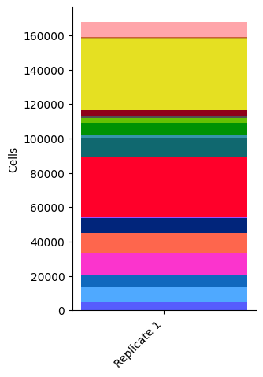
    


#### Figure demonstrating cell and cell type  interpolation of Visium data from Xenium data
Similar to transcript counts, the Xenium cells themselves may be binned to Visium spots. The figure below overlays Xenium cells and their cell types on top of Visium space-filling polygons. The following dataset is composed of exactly this binning. 


```python
## Data setup
## Collection of Xenium nucleus boundaries from the parquet file. Polygons are organized in order and each row
## corresponds to an individual vertex.
## This line is the slow bit. Cache for faster plotting.
xenium_nucleous_polygons = [
    poly[["vertex_x", "vertex_y"]].values
    for i, poly in xenium_nucleous_boundaries_df.groupby("cell_id")
]


## Transform Xenium nucleus boundary polygons into the Visium high resolution coordinate space.
xenium_nucleous_polygons_visium_high_res = [
    transform_coordinates(poly, xenium_to_visium_full_res_transformation)
    * visium_scale_factors["tissue_hires_scalef"]
    for poly in xenium_nucleous_polygons
]

## Xenium capture area polygon is transformed into Visium high resolution image coordinates.
xenium_capture_polygon_um = get_xenium_capture_polygon_um(path_to_xenium_bundle)
xenium_capture_polygon_visium_high_res = (
    transform_coordinates(
        xenium_capture_polygon_um, xenium_to_visium_full_res_transformation
    )
    * visium_scale_factors["tissue_hires_scalef"]
)

## Space-filling polygons are generated and then transformed into high resolution image coordinates.
visium_hexegon_polygons = generate_space_filling_visium_polygons(
    spot_coords=visium_tissue_positions[
        ["pxl_col_in_fullres", "pxl_row_in_fullres"]
    ].values,
)


## Visium capture area polygons are generated and then transformed into high resolution image coordinates.
visium_catpure_polygon_full_res = get_visium_capture_polygon(
    spot_centroids=visium_tissue_positions[
        ["pxl_col_in_fullres", "pxl_row_in_fullres"]
    ].values,
    spot_diameter=visium_scale_factors["spot_diameter_fullres"],
)


visium_hexagon_polygons_high_res = (
    visium_hexegon_polygons * visium_scale_factors["tissue_hires_scalef"]
)
visium_catpure_polygon_high_res = (
    visium_catpure_polygon_full_res * visium_scale_factors["tissue_hires_scalef"]
)


## plot style setup
fig = plt.figure(figsize=(8, 8))
ax = plt.gca()


## Plotting code
ax.imshow(visium_high_res_image)
plot_polygons(
    visium_hexagon_polygons_high_res,
    ax=ax,
    facecolor=(0, 0, 0, 0),
    edgecolor="black",
    linewidth=1,
)
plot_polygons(
    [visium_catpure_polygon_high_res],
    ax=ax,
    facecolor=(0, 0, 0, 0),
    edgecolor="cyan",
    linewidth=1,
)

plot_polygons(
    xenium_nucleous_polygons_visium_high_res,
    ax=ax,
    array=list(map(ctype_to_code_map.get, xenium_celltype_df.Cluster.values)),
    edgecolor="black",
    linewidth=0.01,
    norm=Normalize(vmin=0, vmax=len(celltypes)),
    cmap=ctype_cmap,
)

plot_polygons(
    [xenium_capture_polygon_visium_high_res],
    ax=ax,
    facecolor=(0, 0, 0, 0),
    edgecolor="blue",
    linewidth=1,
)

## Plot style adjustments
ax.spines.right.set_visible(False)
ax.spines.top.set_visible(False)
ax.yaxis.set_ticks_position("left")
ax.xaxis.set_ticks_position("bottom")
ax.set_aspect("equal", adjustable="box")
```


    
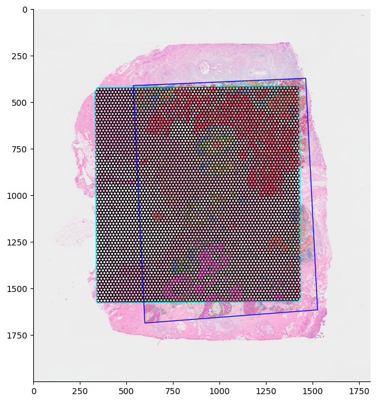
    


### Visium spot interpolation of Xenium cell data using Xenium/Visium registration


```python
## Get cell -> Visium barcode assignments.
xenium_spotbinned_cell_barcodes = bin_xenium_data_to_visium_spots(
    visium_spot_centroids=visium_tissue_positions[
        ["pxl_col_in_fullres", "pxl_row_in_fullres"]
    ].values,
    visium_spot_diameter=visium_scale_factors["spot_diameter_fullres"],
    visium_barcodes=visium_tissue_positions.index.values,
    xenium_coords=xenium_cell_info[["x_centroid", "y_centroid"]].values,
    xenium_to_visium_transform=xenium_to_visium_full_res_transformation,
)

## Filter cells outside of Visium capture area.
unassigned_cell_mask = (
    xenium_spotbinned_cell_barcodes != __OUTSIDE_VISIUM_CAPTURE_AREA_BARCODE__
)

## Generate a spot X cell type dataframe.
xenium_spotbinned_cell_adata = generate_anndata_matrix_from_transcript_assignments(
    barcodes=xenium_spotbinned_cell_barcodes[unassigned_cell_mask],
    feature_names=xenium_celltype_df[unassigned_cell_mask]["Cluster"].values,
)
xenium_spotbinned_celltypes_df = xenium_spotbinned_cell_adata.to_df()

## Normalize each spot to the sum of the cell count. 
xenium_spotbinned_celltypes_normed_df = xenium_spotbinned_celltypes_df.div(
    xenium_spotbinned_celltypes_df.sum(1), axis=0
)
```


```python
xenium_spotbinned_celltypes_normed_df
```


<div>
<table border="1">
  <thead>
    <tr style="text-align: right;">
      <th></th>
      <th>DCIS_2</th>
      <th>Macrophages_2</th>
      <th>Myoepi_ACTA2+</th>
      <th>IRF7+_DCs</th>
      <th>Invasive_Tumor</th>
      <th>Prolif_Invasive_Tumor</th>
      <th>Stromal</th>
      <th>T_Cell_&amp;_Tumor_Hybrid</th>
      <th>Endothelial</th>
      <th>Myoepi_KRT15+</th>
      <th>Perivascular-Like</th>
      <th>LAMP3+_DCs</th>
      <th>Stromal_&amp;_T_Cell_Hybrid</th>
      <th>Unlabeled</th>
      <th>B_Cells</th>
      <th>DCIS_1</th>
      <th>Macrophages_1</th>
      <th>Mast_Cells</th>
      <th>CD8+_T_Cells</th>
      <th>CD4+_T_Cells</th>
    </tr>
  </thead>
  <tbody>
    <tr>
      <th>GGTGTCAAGCTGCACC-1</th>
      <td>0.055556</td>
      <td>0.0</td>
      <td>0.000000</td>
      <td>0.0</td>
      <td>0.000000</td>
      <td>0.000000</td>
      <td>0.000000</td>
      <td>0.000000</td>
      <td>0.000000</td>
      <td>0.000000</td>
      <td>0.0</td>
      <td>0.000000</td>
      <td>0.0</td>
      <td>0.000000</td>
      <td>0.0</td>
      <td>0.925926</td>
      <td>0.018519</td>
      <td>0.0</td>
      <td>0.000000</td>
      <td>0.000000</td>
    </tr>
    <tr>
      <th>GTCACTTATGAATGCG-1</th>
      <td>0.000000</td>
      <td>0.0</td>
      <td>0.000000</td>
      <td>0.0</td>
      <td>0.000000</td>
      <td>0.000000</td>
      <td>1.000000</td>
      <td>0.000000</td>
      <td>0.000000</td>
      <td>0.000000</td>
      <td>0.0</td>
      <td>0.000000</td>
      <td>0.0</td>
      <td>0.000000</td>
      <td>0.0</td>
      <td>0.000000</td>
      <td>0.000000</td>
      <td>0.0</td>
      <td>0.000000</td>
      <td>0.000000</td>
    </tr>
    <tr>
      <th>GCACCTAGCCGAATCT-1</th>
      <td>0.000000</td>
      <td>0.0</td>
      <td>0.303571</td>
      <td>0.0</td>
      <td>0.000000</td>
      <td>0.000000</td>
      <td>0.321429</td>
      <td>0.000000</td>
      <td>0.035714</td>
      <td>0.321429</td>
      <td>0.0</td>
      <td>0.000000</td>
      <td>0.0</td>
      <td>0.017857</td>
      <td>0.0</td>
      <td>0.000000</td>
      <td>0.000000</td>
      <td>0.0</td>
      <td>0.000000</td>
      <td>0.000000</td>
    </tr>
    <tr>
      <th>CTCCTTATCTTAAGAC-1</th>
      <td>0.000000</td>
      <td>0.0</td>
      <td>0.000000</td>
      <td>0.0</td>
      <td>0.000000</td>
      <td>0.000000</td>
      <td>1.000000</td>
      <td>0.000000</td>
      <td>0.000000</td>
      <td>0.000000</td>
      <td>0.0</td>
      <td>0.000000</td>
      <td>0.0</td>
      <td>0.000000</td>
      <td>0.0</td>
      <td>0.000000</td>
      <td>0.000000</td>
      <td>0.0</td>
      <td>0.000000</td>
      <td>0.000000</td>
    </tr>
    <tr>
      <th>ATGTACATCGTGGTTA-1</th>
      <td>0.000000</td>
      <td>0.0</td>
      <td>0.000000</td>
      <td>0.0</td>
      <td>0.857143</td>
      <td>0.079365</td>
      <td>0.031746</td>
      <td>0.000000</td>
      <td>0.000000</td>
      <td>0.000000</td>
      <td>0.0</td>
      <td>0.000000</td>
      <td>0.0</td>
      <td>0.015873</td>
      <td>0.0</td>
      <td>0.000000</td>
      <td>0.015873</td>
      <td>0.0</td>
      <td>0.000000</td>
      <td>0.000000</td>
    </tr>
    <tr>
      <th>...</th>
      <td>...</td>
      <td>...</td>
      <td>...</td>
      <td>...</td>
      <td>...</td>
      <td>...</td>
      <td>...</td>
      <td>...</td>
      <td>...</td>
      <td>...</td>
      <td>...</td>
      <td>...</td>
      <td>...</td>
      <td>...</td>
      <td>...</td>
      <td>...</td>
      <td>...</td>
      <td>...</td>
      <td>...</td>
      <td>...</td>
    </tr>
    <tr>
      <th>GGAGATGGCTCGAGAT-1</th>
      <td>0.000000</td>
      <td>0.0</td>
      <td>0.000000</td>
      <td>0.0</td>
      <td>0.111111</td>
      <td>0.000000</td>
      <td>0.888889</td>
      <td>0.000000</td>
      <td>0.000000</td>
      <td>0.000000</td>
      <td>0.0</td>
      <td>0.000000</td>
      <td>0.0</td>
      <td>0.000000</td>
      <td>0.0</td>
      <td>0.000000</td>
      <td>0.000000</td>
      <td>0.0</td>
      <td>0.000000</td>
      <td>0.000000</td>
    </tr>
    <tr>
      <th>TACTCCTGAAGGATTA-1</th>
      <td>0.000000</td>
      <td>0.0</td>
      <td>0.000000</td>
      <td>0.0</td>
      <td>0.627907</td>
      <td>0.000000</td>
      <td>0.139535</td>
      <td>0.000000</td>
      <td>0.000000</td>
      <td>0.000000</td>
      <td>0.0</td>
      <td>0.046512</td>
      <td>0.0</td>
      <td>0.000000</td>
      <td>0.0</td>
      <td>0.000000</td>
      <td>0.069767</td>
      <td>0.0</td>
      <td>0.023256</td>
      <td>0.093023</td>
    </tr>
    <tr>
      <th>CCGCACAACGTGGTCA-1</th>
      <td>0.505376</td>
      <td>0.0</td>
      <td>0.021505</td>
      <td>0.0</td>
      <td>0.397849</td>
      <td>0.032258</td>
      <td>0.010753</td>
      <td>0.010753</td>
      <td>0.000000</td>
      <td>0.000000</td>
      <td>0.0</td>
      <td>0.000000</td>
      <td>0.0</td>
      <td>0.021505</td>
      <td>0.0</td>
      <td>0.000000</td>
      <td>0.000000</td>
      <td>0.0</td>
      <td>0.000000</td>
      <td>0.000000</td>
    </tr>
    <tr>
      <th>CTACGATGCGTCCGGC-1</th>
      <td>0.000000</td>
      <td>0.0</td>
      <td>0.000000</td>
      <td>0.0</td>
      <td>0.000000</td>
      <td>0.000000</td>
      <td>1.000000</td>
      <td>0.000000</td>
      <td>0.000000</td>
      <td>0.000000</td>
      <td>0.0</td>
      <td>0.000000</td>
      <td>0.0</td>
      <td>0.000000</td>
      <td>0.0</td>
      <td>0.000000</td>
      <td>0.000000</td>
      <td>0.0</td>
      <td>0.000000</td>
      <td>0.000000</td>
    </tr>
    <tr>
      <th>CTTAGTAAGCGTGGCA-1</th>
      <td>0.000000</td>
      <td>0.0</td>
      <td>0.000000</td>
      <td>0.0</td>
      <td>0.714286</td>
      <td>0.142857</td>
      <td>0.040816</td>
      <td>0.000000</td>
      <td>0.061224</td>
      <td>0.000000</td>
      <td>0.0</td>
      <td>0.000000</td>
      <td>0.0</td>
      <td>0.020408</td>
      <td>0.0</td>
      <td>0.000000</td>
      <td>0.020408</td>
      <td>0.0</td>
      <td>0.000000</td>
      <td>0.000000</td>
    </tr>
  </tbody>
</table>
<p>3958 rows × 20 columns</p>
</div>


